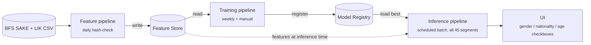

# Swiss Segmented Unemployment Rate Predictor

MLOPS HS26 semester project — Hochschule Luzern

Full proposal: [`docs/proposal.pdf`](docs/proposal.pdf)

## What this predicts

Switzerland's ILO unemployment rate for the **next quarter** — the national total,
and independently for each of 44 demographic segments (gender × nationality × age
bracket), 45 series in total. All 45 are forecast automatically on every run; the UI
only lets you *view* a segment's forecast, it doesn't trigger a new prediction.

## Architecture (FTI)



| Stage | What it does | Trigger |
|---|---|---|
| **Feature pipeline** | Pulls SAKE unemployment + LIK inflation data from the `opendata.swiss` CKAN API, builds lag/seasonal/covariate features, writes to the feature store | Daily hash-check (sources update quarterly/monthly) |
| **Training pipeline** | Trains one pooled LightGBM model across all 45 segments, registers it | Weekly + manual dispatch |
| **Inference pipeline** | Loads the best registered model, produces all 45 forecasts in a batch, serves them | Scheduled, after each training run |

## Tech stack

- **Model**: LightGBM (pooled, single model across all segments)
- **Feature store**: versioned Parquet on GCS
- **Experiment tracking + registry**: Weights & Biases (academic tier)
- **Orchestration**: GitHub Actions
- **Serving**: FastAPI backend + Streamlit frontend, containerized, deployed on Google Cloud Run

See [`docs/proposal.pdf`](docs/proposal.pdf) for the full data source, feature, and evaluation details.

## Repository layout

```
.
├── .github/workflows/      # scheduled feature/training pipeline jobs
├── data/
│   ├── raw/                # fetched source CSVs (gitignored)
│   └── processed/          # engineered feature tables (gitignored)
├── docs/
│   └── proposal.pdf        # MS1 proposal
├── notebooks/               # exploratory analysis, backfill checks
├── src/
│   ├── feature_pipeline/    # ingestion + feature engineering
│   ├── training_pipeline/   # LightGBM training + W&B logging/registry
│   ├── inference_pipeline/  # FastAPI + Streamlit serving
│   └── common/              # shared config, data schemas
├── tests/
├── .env.example
├── .gitignore
├── Dockerfile
├── requirements.txt
└── README.md
```

## Local setup

```bash
git clone https://github.com/theodorahaimoff/HSLU_HS26_MLOPS.git
cd HSLU_HS26_MLOPS
python -m venv .venv && source .venv/bin/activate
pip install -r requirements.txt
cp .env.example .env 
```

## Running the pipelines locally

```bash
python -m src.feature_pipeline.ingest      # fetch + build features
python -m src.training_pipeline.train      # train + register pooled model
uvicorn src.inference_pipeline.api:app     # start the FastAPI backend
streamlit run src/inference_pipeline/app.py  # start the UI
```